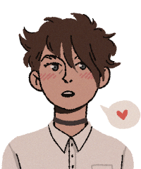

> \
_A toolkit for producing games and mechanics in C#._

> \
_A library for generating formatted and highlighted code samples in C#._

> \
_A voxel file parser, scene management, and voxel meshing library in C#._

> \
_An **[ASP.NET Core](https://dotnet.microsoft.com/apps/aspnet)** application hosting my porfolio._

_Check out more of my [projects here](https://github.com/Fydar?tab=repositories)._\

